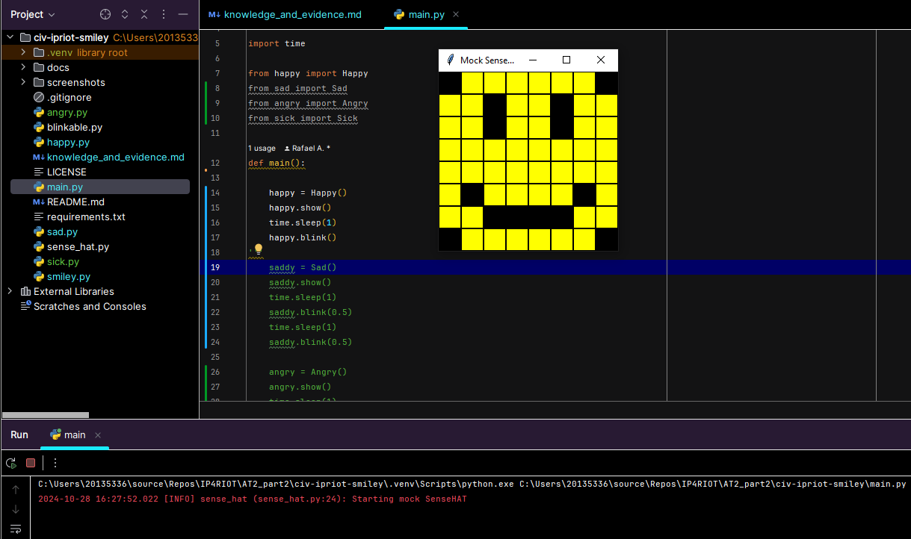
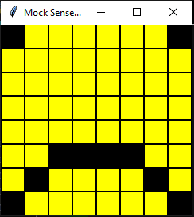
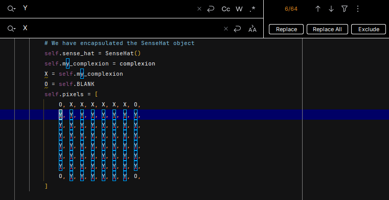

<style>

body {
    counter-reset: h2counter;
}

/* H1 - No numbering */
h1 {
    /* No counter reset or increment */
}

/* H2 - Level 1 numbering */
h2 {
    counter-reset: h3counter;
}

h2::before {
    counter-increment: h2counter;
    content: counter(h2counter) ". ";
}

/* H3 - Level 2 numbering */
h3 {
    counter-reset: h4counter;
}

h3::before {
    counter-increment: h3counter;
    content: counter(h2counter) "." counter(h3counter) " ";
}

/* H4 - Level 3 numbering (optional) */
h4 {
    counter-reset: h5counter;
}

h4::before {
    counter-increment: h4counter;
    content: counter(h2counter) "." counter(h3counter) "." counter(h4counter) " ";
}

</style>

# Evidence and Knowledge

This document includes instructions and knowledge questions that must be completed to receive a *Competent* grade on this portfolio task.

## Required evidence

### Answer all questions in this document

- Each answer should be complete, well-articulated, and within the specified word count limits (if added) for each question.
- Please make sure **all** external sources are properly cited.
- You must **use your own words**. Please include your full chat transcripts if you use generative AI in any way.
- Generative AI hallucinates, is not an authoritative source

### Make all the required modifications to the code

- Please follow the instructions in this document to make the changes needed to the code.

- When requested to upload evidence, upload all screenshots to `screenshots/` and embed them in this document. For example:

```markdown

```

- You must upload the code into your GitHub repository.
- While you can use a branch, your code should be in main when you submit.
- Upload a zip of this repository to Blackboard when you are ready to submit.
- You will be notified of your result via Blackboard
- However, if using GitHub classrooms, you may also receive additional feedback on GitHub directly

### Optional: Use of Raspberry Pi and SenseHat

Raspberry Pi or SenseHat is **optional** for this activity. You can use the included `sense_hat.py` file to simulate the SenseHat on your computer.

If you use a Pi, please **delete** the `sense_hat.py` file.

### Accessible version of the code

This project relies on visual patterns that appear on an LED matrix. If you have any accessibility requirements, you can use the `udl/accessible` branch to complete the project. This branch provides an accessible code version that uses text-based patterns instead of visual ones.

Please discuss this with your lecturer before using that branch.

## Specific Tasks & Questions

Address the following tasks and questions based on the code provided in this repository.

### Set up the project locally

1. Fork this repository (if not using GitHub Classrooms)
2. Clone your repository locally
3. Run the project locally by executing the `main.py` file
4. Evidence this by providing screenshots of the project directory structure and the output of the `main.py` file



If you are running on a Raspberry Pi, you can use the following command to run the project and then screenshot the result:

```bash
ls
python3 main.py
```

### Fundamental code comprehension

 Answer each of the following questions **as they relate to that code** supplied by in this repository (ignore `sense_hat.py`):

1. Examine the code for the `smiley.py` file and provide  an example of a variable of each of the following types and their corresponding values (`_` should be replaced with the appropriate values):

   | Type                    | name                   | value                         |
   | ----------              |------------------------|-------------------------------|
   | built-in primitive type | boolean                | dimmed, True                  |
   | built-in composite type | Tuples (int, int, int) | Yellow, (255, 255, 0)         |
   | user-defined type       | List [Tuples]          | self.pixels, [(255,255,0),(0,0,0)...] |

2. Fill in (`_`) the following table based on the code in `smiley.py`:

   | Object                   | Type                   |
   | ------------             |------------------------|
   | self.pixels              | List [Tuples]          |
   | A member of self.pixels  | Tuples (int, int, int) |
   | self                     | Smiley                 |

3. Examine the code for `smiley.py`, `sad.py`, and `happy.py`. Give an example of each of the following control structures using an example from **each** of these files. Include the first line and the line range:

   | Control Flow | File      | First line                  | Line range        |
   | ------------ |-----------|-----------------------------|-------------------|
   |  sequence    | smiley.py | self.sense_hat = SenseHat() | line 13 - line 27 |
   |  selection   | sad.py    | if wide_open:               | line 26 - line 29 |
   |  iteration   | happy.py  | for pixel in mouth:         | line 21 - line 23 |

4. Though everything in Python is an object, it is sometimes said to have four "primitive" types. Examining the three files `smiley.py`, `sad.py`, and `happy.py`, identify which of the following types are used in any of these files, and give an example of each (use an example from the code, if applicable, otherwise provide an example of your own):

   | Type                    | Used? | Example          |
   | ----------------------- |-------|------------------|
   | int                     | No    | number = 1       |
   | float                   | Yes   | delay = 0.25     |
   | str                     | No    | name = "smiley"  |
   | bool                    | Yes   | wide_open = True |

5. Examining `smiley.py`, provide an example of a class variable and an instance variable (attribute). Explain **why** one is defined as a class variable and the other as an instance variable.

> Example of class variable: WHITE = (255,255,255)
> 
> Example of instance variable: dimmed = True
> 
> Colors such as white and yellow are defined as class variable as it would remain same for all the instances of the class.
> 
> Boolean variable dimmed in dim_display method is an instance variable as it's value can change for different instances of the class. 

6. Examine `happy.py`, and identify the constructor (initializer) for the `Happy` class:
   1. What is the purpose of a constructor (in general) and this one (in particular)?

   > The method with the name `__init__` is the constructor/initializer for the `Happy` class.
   > 
   > The purpose of the constructor is to construct an instance of the class.
   > This one in particular does not take any parameters, 
   > it initializes the parent class using the `super` keyword and calls some methods from the class. 
   >

   2. What statement(s) does it execute (consider the `super` call), and what is the result?

   > The `__init__` method executes three lines, 
   >
   > The first line initializes/constructs the parent class `smiley` using the `super().__init__()` method,
   > setting up a `sense_hat` object and defining pixels. 
   >
   > The second statement calls the method `draw_mouth()`, which changes the pixels defined earlier to render/draw a mouth.
   > 
   >The third statement calls the method `draw_eyes()`, which changes the pixel defined earlier to render/draw eyes. 
 

### Code style

1. What code style is used in the code? Is it likely to be the same as the code style used in the SenseHat? Give to reasons as to why/why not:
   
> pep8 code style is used in the code. 
> Yes it is likely to be the same as the code style used in the SenseHat as code style guidelines should be followed throughout the code.  
> 

2. List three aspects of this convention you see applied in the code.

> Variables name and method names follow the conventions of pep8, have a descriptive name and are written in snake_case.
>
> follows indentation
> 
> Has Doc string under functions. 

3. Give two examples of organizational documentation in the code.

> Two examples of organizational documentation in the code are:
> >1. README.md
> >2. LICENSE
>

### Identifying and understanding classes

> Note: Ignore the `sense_hat.py` file when answering the questions below

1. List all the classes you identified in the project. Indicate which classes are base classes and which are subclasses. For subclasses, identify all direct base classes.
  
  Use the following table for your answers:

| Class Name | Super or Sub? | Direct parent(s)  |
|------------|---------------|-------------------|
| NotReal    | Sub           | NotRealParent     |
| Blinkable  | Sub           | ABC               |
| Smiley     | Super         | ---               |
| Happy      | Sub           | Smiley, Blinkable |
| Sad        | Sub           | Smiley            |

2. Explain the concept of abstraction, giving an example from the project (note "implementing an ABC" is **not** in itself an example of abstraction). (Max 150 words)

> The concept of abstraction is to hide complexities or details of implementation.
> 
> for example in the class `Happy` to draw eyes we can call the function `draw_eyes()`
> but we don't need to know which pixels to replace/edit to render eyes as it's hidden under the draw_eyes method.
> 
>

3. What is the name of the process of deriving from base classes? What is its purpose in this project? (Max 150 words)

> The process of deriving from base classes is called inheritance.
> 
> The purpose of inheritance in this project is to make the `subclasses` of class `smiley` such as `happy` and `sad` 
> have same base pixels and constants such as colors.
>  
>

### Compare and contrast classes

Compare and contrast the classes Happy and Sad.

1. What is the key difference between the two classes?
   > Class happy has two super/parent class(Smiley, Blinkable) and class sad has only on super/parent class(Smiley).
   > 
   > Class happy has blink method and Class sad does not have a blink method.
   >

2. What are the key similarities?
   > Both the classes has smiley as a super class.
   > 
   > Both the classes has `draw_eyes()` and `draw_mouth()` methods
   >
3. What difference stands out the most to you and why?
   > It stands out to me the most that sad class does not derive from class Blinkable because its stops class `sad` from being able to use the abstract method `blink()`
   >
4. How does this difference affect the functionality of these classes
   > This difference makes happy class able to use the blink abstract method while sad won't be able to use it.
   >

### Where is the Sense(Hat) in the code?

1. Which class(es) utilize the functionality of the SenseHat?
   > The class smiley and its subclass utilize the functionality of the SenseHat.
   >
2. Which of these classes directly interact with the SenseHat functionalities?
   >  The class Smiley directly interacts with the SenseHat functionalities.
   >
3. Discuss the hiding of the SenseHAT in terms of encapsulation (100-200 Words)
   > The methods and attributes of the class SenseHAT can be accessed only through the class Smiley.
   > An instance of a SenseHAT class in instantiated in the constructor method of the class Smiley.
   > Encapsulation is the principle of bundling attributes and methods into a single class.
   > SenseHat object is encapsulated together with class Smiley. 
   >

### Sad Smileys Can’t Blink (Or Can They?)

Unlike the `Happy` smiley, the current implementation of the `Sad` smiley does not possess the ability to blink. Let's first explore how blinking has been implemented in the Happy Smiley by examining the blink() method, which takes one argument that determines the duration of the blink.

**Understanding Blink Mechanism:**

1. Does the code's author believe that every `Smiley` should be able to blink? Explain.

> I think the author does not believe that every smiley should be able to blink because `Smiley` class does not contain a blink method.
> If the author believed that every smiley should be able to blink he/she would have added a blink method to the class `Smiley`.
>

2. For those smileys that blink, does the author expect them to blink in the same way? Explain.

> For the smileys that blink the author does not expect them to blink in the same way as the blink method that is derived from the
> class `Blinkable` is an abstract method.
>

3. Referring to the implementation of blink in the Happy and Sad Smiley classes, give a brief explanation of what polymorphism is.

> Polymorphism means many forms. blink method in Happy and Sad Smiley classes can have the same method name 
> but have very different implementation.   
>

4. How is inheritance used in the blink method, and why is it important for polymorphism?

> Blink method is an abstract method from class Blinkable, abstract method decorator allows the method to be used by all the inheriting class in their own way.
>
1. **Implement Blink in Sad Class:**

   - Create a new method called `blink` within the Sad class. Ensure you use the same method signature as in the Happy class:

   ```python
   def blink(self, delay=0.25):
       pass  # Replace 'pass' with your implementation
   ```

2. **Code Implementation:** Implement the code that allows the Sad smiley to blink. Use the implementation from the Happy Smiley as a reference. Ensure your new method functions similarly by controlling the blink duration through the `delay` argument.

3. **Testing the Implementation:**

- Test the new blink functionality on your Raspberry Pi or within the Python classes provided. You might need to adjust the `main.py` script to incorporate Sad Smiley's new blinking capability.

Include a screenshot of the sad smiley or the modified `main.py`:



- Observe and document the Sad smiley as it blinks its eyes. Describe any adjustments or issues encountered during implementation.

  > No issues, I had to instantiate an object of class `Sad` and call the blink method with a longer delay time to take screenshot.  

  ### If It Walks Like a Duck…

  Previously, you implemented the blink functionality for the Sad smiley without utilizing the class `Blinkable`. Assuming you did not use `Blinkable` (even if you actually did), consider how the Sad smiley could blink similarly to the Happy smiley without this specific class.

  1. **Class Type Analysis:** What kind of class is `Blinkable`? Inspect its superclass for clues about its classification.

     > Blinkable is an abstract base class.

  2. **Class Implementation:** `Blinkable` is a class intended to be implemented by other classes. What generic term describes this kind of class, which is designed for implementation by others? **Clue**: Notice the lack of any concrete implementation and the naming convention.

  > The generic term that describes this kind of class is called abstract classes.

  3. **OO Principle Identification:** Regarding your answer to question (2), which Object-Oriented (OO) principle does this represent? Choose from the following and justify your answer in 1-2 sentences: Abstraction, Polymorphism, Inheritance, Encapsulation.

  > It represents the principle of Abstraction because it hides the complexities and the implementation of the blink method, but we can know that there is a blink method. 

  4. **Implementation Flexibility:** Explain why you could grant the Sad Smiley a blinking feature similar to the Happy Smiley's implementation, even without directly using `Blinkable`.

  > We can directly grant Sad Smiley a blinking feature similar to Happy Smiley's implementation, even without directly using `Blinkable` because it's not mandatory to use `Blinkable` to have a blinking feature.

  5. **Concept and Language Specificity:** In relation to your response to question (4), what is this capability known as, and why is it feasible in Python and many other dynamically typed languages but not in most statically typed programming languages like C#? **Clue** This concept is hinted at in the title of this section.

  > The capability is known as Duck typing.

  ***

  ## Refactoring

  ### Does a Smiley Have to Be Yellow?

  While our current implementation predominantly features yellow smileys, emotional expressions like sickness or anger typically utilize colors like green, red, or orange. We'll explore the feasibility of integrating these colors into our smileys.

  1. **Defined Colors and Their Location:**

     1. Which colors are defined and in which class(s)?
        > colors white, red, green and yellow are defined in the class `Smiley`.
     2. What type of variables hold these colors? Are the values expected to change during the program's execution? Explain your answer.
        > Tuples hold these colors, tuples are immutable so the values won't be changed during program's execution. 
     3. Add the color blue to the appropriate class using the appropriate format and values.

  2. **Usage of Color Variables:**

     1. In which classes are the color variables used?
        > Color variables are used in classes `Smiley`, `Happy` and `Sad`.

  3. **Simple Method to Change Colors:**
  4. What is the easiest way you can think to change the smileys to green? Easiest, not necessarily the best!
     > By changing the value of the variable Y in the constructor method of the class `Smiley` to "self.GREEN".

  Here's a revised version of the "Flexible Colors – Step 1" section for the smiley project, incorporating your specifications for formatting and content updates:

  ### Flexible Colors – Step 1

  Changing the color of the smileys once is straightforward, but it isn't very flexible. To facilitate various colors for smileys, it is advisable not to hardcode values in any class. This approach was identified earlier as a necessary change. Let's start by removing the built-in assumptions about color in our classes.

  1. **Add a method called `complexion` to the `Smiley` class:** Implement this instance method to return `self.YELLOW`. Using the term "complexion" instead of "color" provides a more abstract terminology that focuses on the meaning rather than implementation.

  2. **Refactor subclasses to use the `complexion` method:** Modify any subclass that directly accesses the color variable to instead utilize the new `complexion` method. This ensures that color handling is centralized and can be easily modified in the future.

  3. **Determine the applicable Object-Oriented principle:** Consider whether Abstraction, Polymorphism, Inheritance, or Encapsulation best applies to the modifications made in this step.

  4. **Verify the implementation:** Ensure that the modifications function as expected. The smileys should still display in yellow, confirming that the new method correctly replaces the direct color references.

  This step is crucial for setting up a more flexible system for color management in the smiley display logic, allowing for easy adjustments and extensions in the future.

  ### Flexible Colors – Step 2

  Having removed the hardcoded color values, we now enhance the base class to support dynamic color assignments more effectively.

  1. **Modify the `__init__()` method in the `Smiley` class:** Introduce a default argument named `complexion` and assign `YELLOW` as its default value. This allows the instantiation of smileys with customizable colors.

  2. **Introduce a new instance variable:** Create a variable called `my_complexion` and assign the `complexion` parameter to it. This step ensures that each smiley instance can maintain its own color state.

  3. **Rationale for `my_complexion`:** Using a distinct instance variable like `my_complexion` avoids potential conflicts with the method parameter names and clarifies that it is an attribute specific to the object.

  4. **Bulk rename:** We want to update our grid to use the value of complexion, but we have so many `Y`'s in the grid. Use your IDE's refactoring tool to rename all instances of the **symbol** `Y` to `X`. Where `X` is the value of the `complexion` variable. Include a screenshot evidencing you have found the correct refactor tool and the changes made.

  

  5. **Update the `complexion` method:** Adjust this method to return `self.my_complexion`, ensuring that whatever color is assigned during instantiation is what the smiley displays.

  6. **Verification:** Run the updated code to confirm that Smileys still defaults to yellow unless specified otherwise.

  ### Flexible Colors – Step 3

  With the foundational changes in place, it's now possible to implement varied smiley colors for different emotional expressions.

  1. **Adjust the `Sad` class initialization:** In the `Sad` class's initializer method, change the superclass call to include the `complexion` argument with the value `self.BLUE`, as shown:

     ```python
     super().__init__(complexion=self.BLUE)
     ```

  2. **Test color functionality for the Sad smiley:** Execute the program to verify that the Sad smiley now appears blue.

  3. **Ensure the Happy smiley remains yellow:** Confirm that changes to the Sad smiley do not affect the default color of the Happy smiley, which should still display in yellow.

  4. **Design and Implement An Angry Smiley:** Create an Angry smiley class that inherits from the `Smiley` class. Set the color of the Angry smiley to red by passing `self.RED` as the `complexion` argument in the superclass call.

  ***
